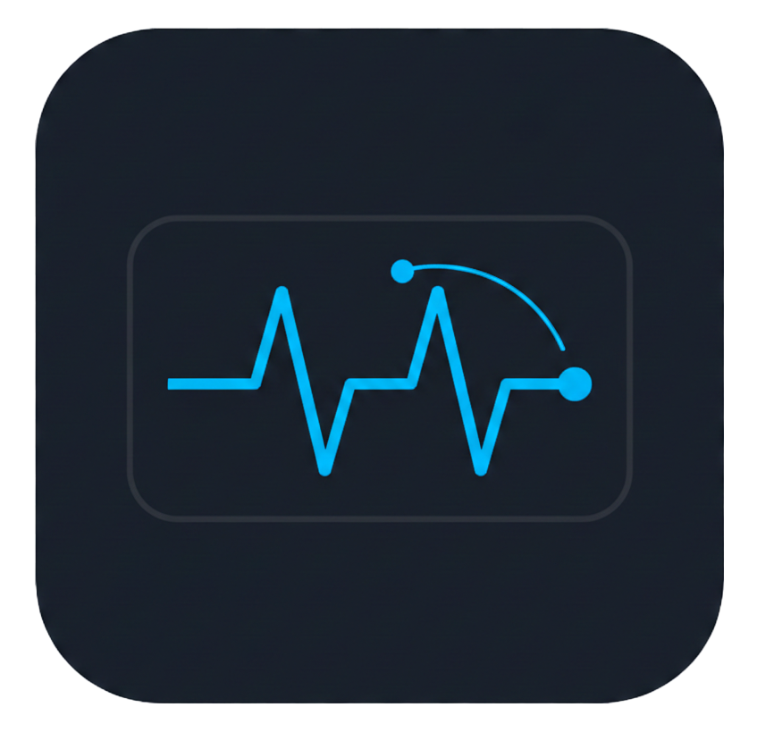
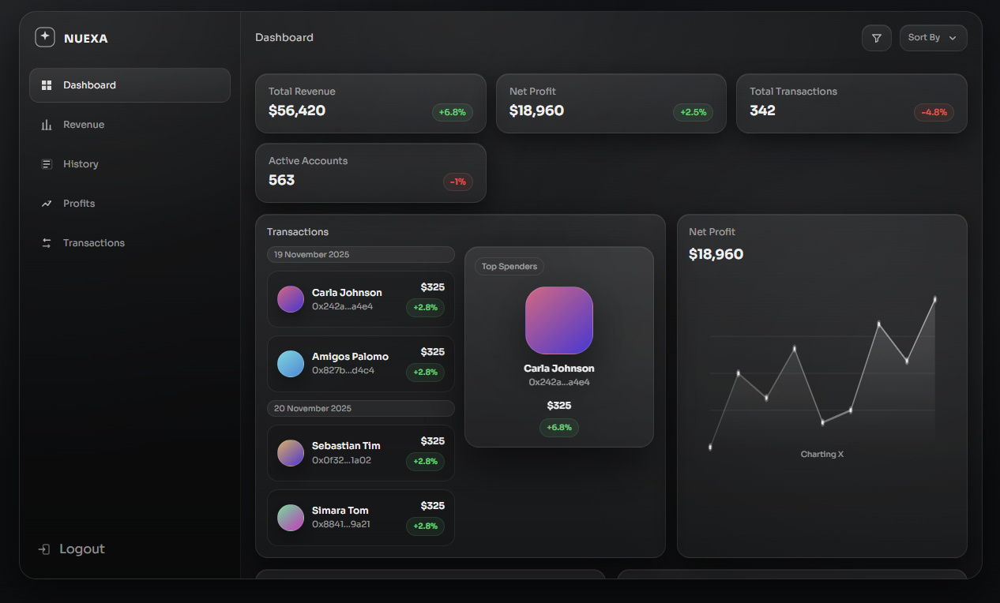
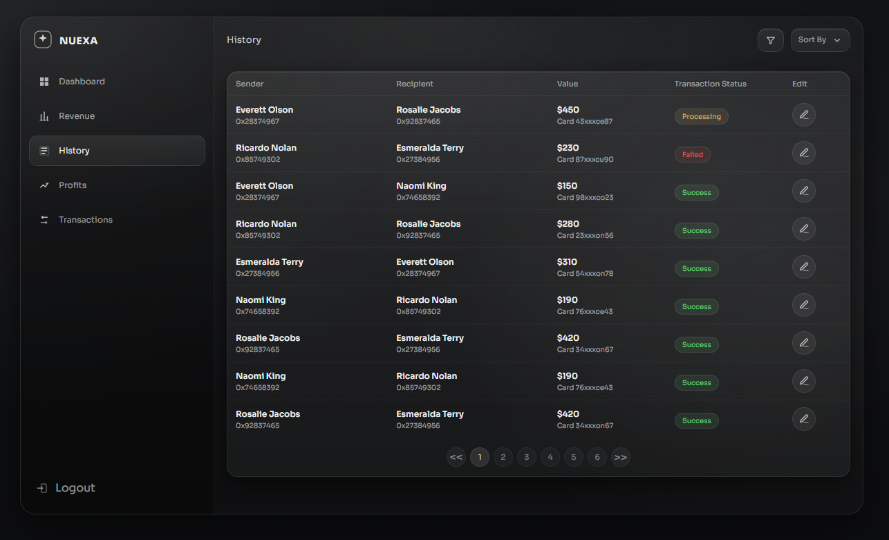
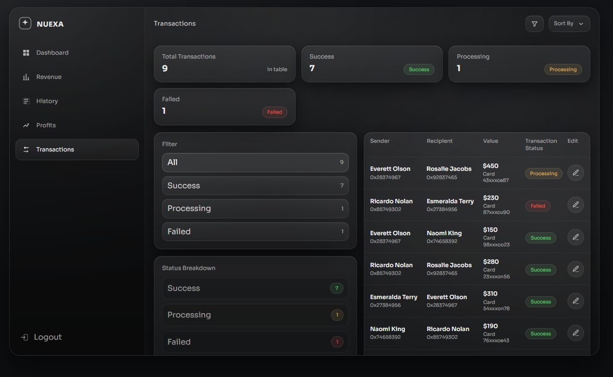

<div align="center">

# NUEXA Dashboard



A modern financial analytics dashboard built with React and TypeScript

</div>

## Tech Stack

- Frontend: React 19, TypeScript 5.9
- Build Tool: Vite 7.3
- Linting: ESLint 9 with React Hooks and Refresh plugins
- Styling: CSS with custom design tokens and glass-morphism UI


## Project Structure

```
src/
├── components/       # Reusable UI components (Icon, Sidebar, TopBar)
├── pages/            # Page-level components (Dashboard, Revenue, Transactions, History, Profits)
├── data/             # Mock data for charts and KPIs
├── App.tsx           # Root component with routing
├── main.tsx          # Application entry point
├── types.ts          # TypeScript type definitions
└── index.css         # Global styles and CSS variables
public/
├── favicon.png       # Application favicon
└── vite.svg          # Vite logo
dist/                 # Production build output
screenshots/          # Project screenshots
package.json          # Dependencies and scripts
README.md             # This file
```

## Screenshots

<h2 align="center">Screenshots</h2>

<p align="center">
  
  
  
</p>
